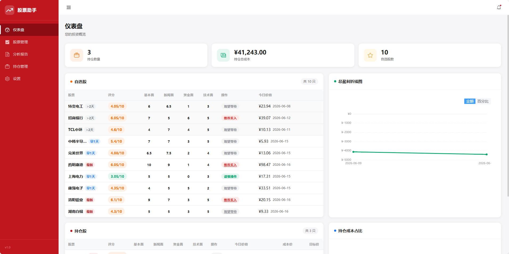
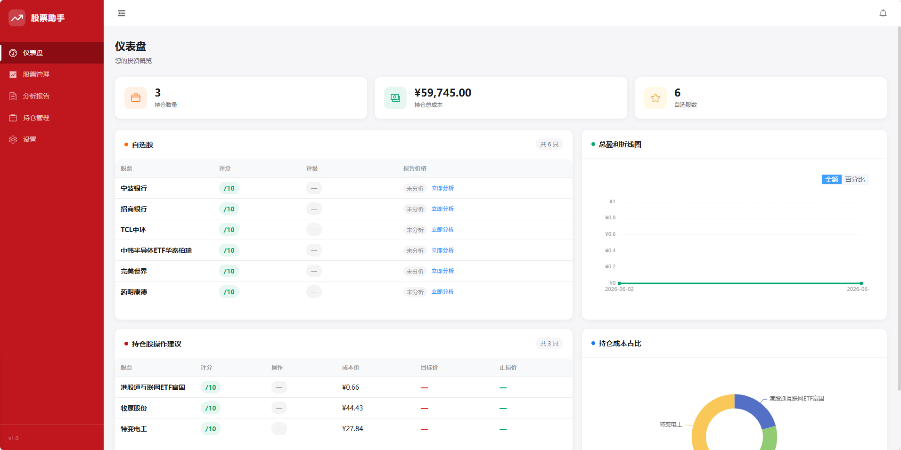

# StockPilot

StockPilot is a local stock analysis workspace built with FastAPI, Vue 3, and SQLite. It combines watchlist management, report archiving, portfolio tracking, scheduled notifications, interactive analysis, and specialist agent workflows in one web app.

## Screenshots

### Main Interface





## Overview

StockPilot is designed for users who want to run a personal stock-analysis workflow locally instead of relying on temporary chat sessions.

It provides:

- Watchlist management with per-stock and bulk analysis
- Structured daily report storage in SQLite and on disk
- Portfolio position tracking and profit history
- Scheduled daily summaries via email or WeCom webhook
- Interactive analysis sessions with streaming updates
- Specialist agent analysis for currently held positions

## Highlights

- Local web application with FastAPI backend and Vue 3 frontend
- SQLite-based persistence for watchlist, reports, portfolio, settings, and notification logs
- Report artifacts saved as Markdown and HTML files under `backend/reports/`
- SSE-based streaming for interactive analysis and agent sessions
- Built-in report rescanning and analysis-history cleanup endpoints
- Settings page for daily-report LLM config, specialist-agent LLM config, and TickFlow API key storage

## Architecture

### Backend

- Entry point: `backend/main.py`
- Framework: FastAPI
- Persistence: SQLAlchemy + SQLite
- Scheduler: APScheduler
- Static report hosting: `/reports`

### Frontend

- Entry point: `frontend/src/main.js`
- Framework: Vue 3 + Vite
- UI library: Element Plus
- Charts: ECharts

### Storage

- Web app database: `backend/data/stock_analysis_app.db`
- Core database helpers also resolve paths under `backend/data/`
- Generated report files: `backend/reports/`

## Prerequisites

- Python `3.10+`
- Node.js `18+`
- npm
- A local `claude` CLI installation for daily-report and interactive analysis flows

Optional but feature-dependent:

- SMTP account and app password for email notifications
- WeCom webhook for enterprise WeChat notifications
- OpenAI-compatible API credentials for specialist agent analysis
- TickFlow API key for TickFlow-backed market data features

## Quick Start

### 1. Install Python dependencies

Install from the repository root because the backend imports packages listed in the top-level `requirements.txt`.

```bash
pip install -r requirements.txt
```

### 2. Install frontend dependencies

```bash
cd frontend
npm install
cd ..
```

### 3. Start the application

Option A: start backend and frontend separately.

```bash
cd backend
python main.py
```

In another terminal:

```bash
cd frontend
npm run dev
```

Option B: use the provided helper script in this repository.

```bash
bash start.sh
```

Windows helper:

```bat
start.bat
```

After startup:

- Frontend: `http://127.0.0.1:5173`
- Backend: `http://127.0.0.1:8000`
- API docs: `http://127.0.0.1:8000/docs`

## Common Commands

### Backend

```bash
cd backend
python main.py
```

### Frontend

```bash
cd frontend
npm run dev
```

### Frontend production build

```bash
cd frontend
npm run build
```

### Frontend preview

```bash
cd frontend
npm run preview
```

### Run frontend utility tests

```bash
node --test frontend/src/utils/*.test.js
```

## Runtime Flows

### Watchlist Daily Analysis

1. Add a stock from the Stocks page or `POST /api/watchlist`.
2. Trigger one stock or the whole watchlist through the analysis endpoints.
3. The backend queues work and runs analysis in FIFO order.
4. The daily-report flow invokes the local `claude` CLI.
5. Generated Markdown is parsed into structured report fields and stored in SQLite.
6. Report artifacts are saved under `backend/reports/`.

Outputs:

- Structured report rows in SQLite
- Markdown report files
- HTML reports when generated
- Queue and status information for the frontend

### Interactive Analysis

Interactive analysis sessions are exposed through:

- `POST /api/analyze/{code}/interactive`
- `GET /api/analyze/{code}/stream`
- `POST /api/analyze/{code}/respond`
- `DELETE /api/analyze/{code}/session`

This flow streams intermediate status, tool-permission prompts, assistant output, and session completion events to the frontend.

### Specialist Agent Analysis

Specialist analysis is intended for currently held positions and uses the agent runtime in `backend/core/agent_runtime.py`.

It depends on these saved settings:

- `agent_api_key`
- `agent_base_url`
- `agent_model`

### Notifications and Scheduling

The Settings page persists configuration in the `settings` table and updates the running scheduler immediately when `schedule_time` changes.

Supported built-in notification channels in the web settings flow:

- Email
- WeCom webhook

Notification attempts are written to the `notification_log` table and surfaced by dashboard endpoints.

## Configuration

There is no `.env.example` file in the repository. Most user-facing runtime settings are stored through the Settings page and persisted in SQLite.

### Daily Report LLM Settings

Saved fields:

- `claude_model`
- `claude_api_key`
- `claude_auth_token`
- `claude_base_url`

When these values are updated, the backend rewrites:

- `backend/reports/.claude/settings.json`

### Specialist Agent Settings

Saved fields:

- `agent_api_key`
- `agent_base_url`
- `agent_model`

These are applied to runtime environment variables used by the specialist agent flow.

### Notification Settings

Saved fields include:

- `smtp_email`
- `smtp_password`
- `receiver_email`
- `wechat_webhook_url`
- `wechat_msg_type`
- `schedule_time`

### TickFlow

Saved field:

- `tickflow_api_key`

The backend applies this value to the `TICKFLOW_API_KEY` environment variable at runtime.

## Known Boundaries

- Daily report generation depends on a local `claude` executable.
- Interactive analysis also depends on Claude-based local tooling.
- Specialist agent analysis requires OpenAI-compatible credentials saved in Settings.
- No `LICENSE`, `CONTRIBUTING.md`, `SECURITY.md`, or `CHANGELOG.md` file was found at the repository root.
- No CI workflow or Docker setup was found in the repository root.

## README Maintenance

Update this README when any of the following change:

- API routes under `backend/api/`
- startup commands or dependency sources
- settings fields persisted in `db.models.Settings`
- report storage paths or database locations
- frontend routes or major user-visible pages