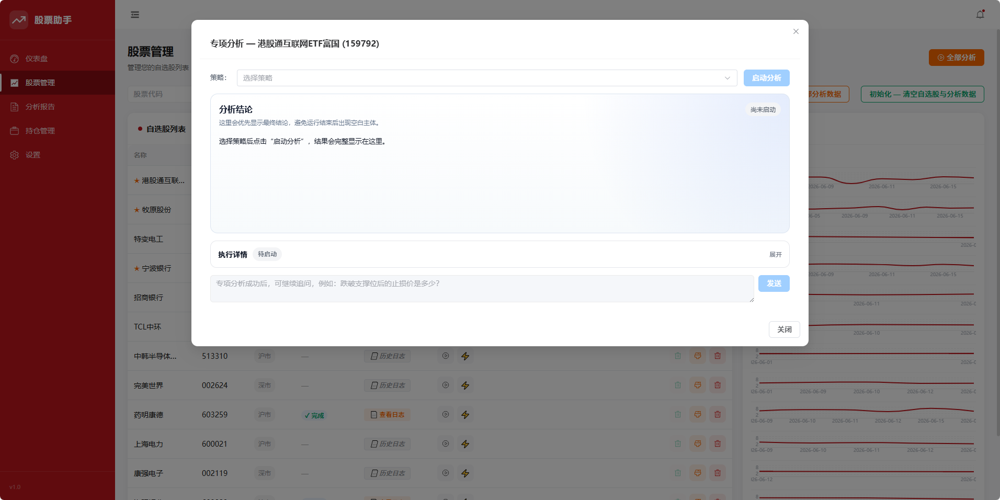

# StockPilot

**StockPilot is an AI-powered investment research workbench — not a real-time
quote terminal, and not a one-off chat session.** It's built for long-term,
conviction-driven investors who track a small, focused set of stocks and want
their AI-generated analysis to persist, accumulate, and be revisited — not
disappear at the end of a chat.

Powered by LLM agents and a FastAPI + Vue 3 + SQLite stack, StockPilot turns
ad-hoc "ask an AI about a stock" into a structured, repeatable research workflow:
daily reports, position-aware specialist analysis, and a searchable archive
of everything the AI has told you, all stored locally.

## Why StockPilot

- **Not a quote/monitoring tool** — no tick-by-tick feeds or minute-level
  alerts. StockPilot is for deep, periodic research on stocks you actually hold
  or are seriously considering, not for watching the market all day.
- **Not a disposable chat** — every AI analysis is saved as structured
  Markdown/HTML and indexed in SQLite, so you can trace how your thesis on a
  stock evolved over weeks or months.
- **Built for a focused watchlist, not the whole market** — designed around
  a handful of stocks you actually care about, with agents that understand
  your current positions, not generic market-wide scanning.

## Screenshots

### Main Interface




## Overview
It provides:
- Watchlist management with per-stock and bulk analysis
- Structured daily report storage in SQLite and on disk
- Portfolio position tracking and profit history
- Scheduled daily summaries via email or WeCom webhook
- Interactive analysis sessions with streaming updates
- Specialist agent analysis for currently held positions

## Highlights
- Report artifacts saved as Markdown and HTML files under `backend/reports/`
- Built-in report rescanning and analysis-history cleanup endpoints
- Settings page for daily-report LLM config, specialist-agent LLM config, and TickFlow API key storage

## Quick Start

### 1. Install Python dependencies

Install from the repository root because the backend imports packages listed in the top-level `requirements.txt`.
python==3.11

```bash
pip install -r requirements.txt
```

### 2. Install frontend dependencies

```bash
cd frontend
npm install
cd ..
```

### 3. Start the application

```bash
bash start.sh
```

## Runtime Flows

### Watchlist Daily Analysis

1. Add a stock from the Stocks page or `POST /api/watchlist`.
2. Trigger one stock or the whole watchlist through the analysis endpoints.
3. The backend queues work and runs analysis in FIFO order.
4. The daily-report flow invokes the local `opencode` CLI
   (see [OpenCode Integration](#opencode-integration) below).
5. Generated Markdown is parsed into structured report fields and stored in SQLite.
6. Report artifacts are saved under `backend/reports/`.

Outputs:

- Structured report rows in SQLite
- Markdown report files
- HTML reports when generated
- Analysis status information for the frontend

### Specialist Agent Analysis

On the Stocks page, the "strategy specialist analysis" button shown for held positions (`frontend/src/views/Stocks.vue`) opens the Agent analysis dialog. This flow is integrated from the `daily_stock_analysis` project (`https://github.com/ZhuLinsen/daily_stock_analysis`) and uses the project's analysis-strategy Skill definitions together with the Agent runtime code under `backend/core/src/agent/`.

It depends on these saved settings:

- `agent_api_key`
- `agent_base_url`
- `agent_model`

### Notifications and Scheduling

The Settings page persists configuration in the `settings` table and updates the running scheduler immediately when `schedule_time` changes.

Supported built-in notification channels in the web settings flow:

- Email
- WeCom webhook

Notification attempts are written to the `notification_log` table and surfaced by dashboard endpoints.

## Configuration

There is no `.env.example` file in the repository. Most user-facing runtime settings are stored through the Settings page and persisted in SQLite.

### Daily Report LLM Settings (OpenCode)

Saved fields:

- `opencode_provider` — one of `opencode-go`, `anthropic`, `openai`, `custom`
- `opencode_model` — `<provider>/<model-id>`, e.g. `opencode-go/minimax-m3`
- `opencode_api_key` — required only for `anthropic` / `openai` / `custom`
  when the gateway does not honour `~/.local/share/opencode/auth.json`
- `opencode_base_url` — required only for custom OpenAI- or Anthropic-
  compatible gateways (e.g. `https://kuaipao.pro`)

When these values are updated, the backend merges them into:

- `~/.config/opencode/opencode.jsonc` (`provider.<provider>` section)

Other sections of `opencode.jsonc` (`plugin`, `lsp`, etc.) are preserved
untouched.

### Specialist Agent Settings

Saved fields:

- `agent_api_key`
- `agent_base_url`
- `agent_model`

These are applied to runtime environment variables used by the specialist agent flow.

### Notification Settings

Saved fields include:

- `smtp_email`
- `smtp_password`
- `receiver_email`
- `wechat_webhook_url`
- `wechat_msg_type`
- `schedule_time`

### TickFlow

Saved field:

- `tickflow_api_key`

The backend applies this value to the `TICKFLOW_API_KEY` environment variable at runtime.

## Known Boundaries

- Daily report generation depends on a local `opencode` CLI (≥ 1.18)
  with the `stock-analyzer` skill installed (see below).
- Interactive analysis also depends on OpenCode-based local tooling.
- Specialist agent analysis requires OpenAI-compatible credentials saved in Settings.

## OpenCode Integration

The daily-report flow shells out to `opencode run` per stock. Two pieces
need to be in place once on the host running the backend.

1. **The `opencode` binary**, discoverable via one of:
   - `~/.opencode/bin/opencode` (default OpenCode install path)
   - `$OPENCODE_BIN` environment variable
   - `opencode` on `$PATH`

2. **The `stock-analyzer` skill**, discoverable via one of:
   - `~/.config/opencode/skills/stock-analyzer/SKILL.md` (user-level)
   - a project-level `skills/stock-analyzer/SKILL.md`

   The skill is bundled with the project under
   `~/.claude/skills/stock-analyzer/`; symlinking it into the
   OpenCode skills directory is sufficient:

   ```bash
   ln -sfn ~/.claude/skills/stock-analyzer \
          ~/.config/opencode/skills/stock-analyzer
   ```

### Picking a model

For OpenCode Go (Coding Plan) subscribers, the cheapest model on the
plan is the default. Anthropic / OpenAI / custom gateways can also be
configured through the Settings page — credentials are written to
`~/.config/opencode/opencode.jsonc`.

## License

This project can be used freely, including personal use, learning, modification, and redistribution within your own workflow.

There is currently no standalone `LICENSE` file in the repository root. If you want that permission to be formalized for external distribution or public reuse, add a root-level `LICENSE` file with the exact terms you want to publish.
